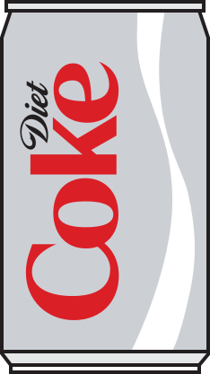

## Diet Coke review in NYC 🗽🥤

This is a simple, markdown-powered website for posting reviews of Diet Cokes at restaurants in NYC.

It is not componentized very well, and doesn't use TypeScript, as a project this pointless doesn't deserve static type checking.

It is largely based on this project: https://github.com/rebelchris/next-markdown-blog.

## Getting Started

First, run the development server:

```bash
npm run dev
```

Open [http://localhost:3000](http://localhost:3000) with your browser to see the result.

## Deploy on Vercel

The easiest way to deploy your Next.js app is to use the [Vercel Platform](https://vercel.com/new?utm_medium=default-template&filter=next.js&utm_source=create-next-app&utm_campaign=create-next-app-readme) from the creators of Next.js.

Check out our [Next.js deployment documentation](https://nextjs.org/docs/deployment) for more details.
